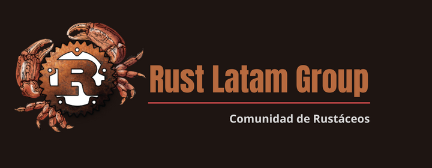

# Rust Latam

Bienvenido a todos, aquí aprenderás a programar en Rust desde cero en español, entre lecciones paso a paso, irás adquiriendo los fundamentos y habilidades necesarias para que puedas programar en este excepcional lenguaje, el código ejemplo te dará una mejor comprensión de los conocimentos adquiridos en cada lección, Rust se caracteriza por La velocidad, la concurrencia y la seguridad en la programación de sistemas. Sin embargo, Rust se ha convertido en una solución para diversos sectores del desarrollo de software y la tecnología, espero que esta guía de aprendisaje pueda ayudarte al máximo y te abra las puertas a nuevas oportunidades como desarrollador de Rust 🦀.

 

## [1. Introducción](https://github.com/FMFigueroa/Rust-Latam/tree/main/src/1.%20Introduction)

- Aprede a programar en Rust
- Qué deberías saber?
- Qué es Rust?
- Versiones de Rust

## [2. Escribe Tu Primer Programa](https://github.com/FMFigueroa/Rust-Latam/tree/main/src/1.%20Introduction)

- Instalando Rust en Windows y macOS
- Anatomía de un programa en Rust
- Añadiendo comentarios
- Construyendo un programa usando Cargo

## [3. Tipo de Datos Primitivos](https://github.com/FMFigueroa/Rust-Latam/tree/main/src/1.%20Introduction)

- Tipos de datos enteros
- Tipos de datos punto-flotantes
- Operaciones Aritmeticas
- Formato de declaraciones de impresión
- Operaciones Bit a Bit
- Operaciones y Tipos de datos Booleanos
- Operaciones de comparación
- Tipos de datos Char

## [4. Tipos de Datos Compuestos](https://github.com/FMFigueroa/Rust-Latam/tree/main/src/1.%20Introduction)

- Arrays
- Arrays Multidimensional
- Tuplas
- Tipos Punteros
- Arrays, Vectores y Slices
- Tipo String
- Tipo Aliases

## [5. Funciones](https://github.com/FMFigueroa/Rust-Latam/tree/main/src/1.%20Introduction)

- Parámetros de una función
- Expresiones vs. Declaraciones
- Valores de retorno de una función

## [6. Control de Flujo del Programa](https://github.com/FMFigueroa/Rust-Latam/tree/main/src/1.%20Introduction)

- Ejecución Condicional
- Múltiples Condiciones
- Asignación Condicional
- Loops
- while Loops
- For Loops
- Nested Loops

## [7. Ownership](https://github.com/FMFigueroa/Rust-Latam/tree/main/src/1.%20Introduction)

- Alcance de una variable
- Sombreado de una variable
- Memoria Stack y Heap
- Tipo de dato String
- Ownership
- Movinendo, Clonando y Copiando datos
- Transferiendo propiedad

## [8. Referencias](https://github.com/FMFigueroa/Rust-Latam/tree/main/src/1.%20Introduction)

- Referencia prenstada
- Referencia mutable
- Referencias colgantes
- Slices
- Slices como parámetro de un función

## [9. Modulos](https://github.com/FMFigueroa/Rust-Latam/tree/main/src/1.%20Introduction)

- Rust Standard Library y Preludio
- Standard input
- Parse string
- Crates

## [10. Input and Output](https://github.com/FMFigueroa/Rust-Latam/tree/main/src/1.%20Introduction)

- Argumentos por la Línea de Comando
- Leyendo desde archivos
- Escribiendo hacia archivos

## [11. Structs](https://github.com/FMFigueroa/Rust-Latam/tree/main/src/1.%20Introduction)

- Defining structs
- Struct update syntax
- Struct methods
- Associated functions
- Tuple structs

## [12. Tipos Genéricos](https://github.com/FMFigueroa/Rust-Latam/tree/main/src/1.%20Introduction)

- Definición de una estructura genérica
- Definición de un método genérico
- Definición de una función genérica
- Punteros Inteligentes Box, RC y Arc

## [13. Traits](https://github.com/FMFigueroa/Rust-Latam/tree/main/src/1.%20Introduction)

- Implement traits
- Default trait implementation
- Derive traits
- Trait bounds
- Multiple trait bounds
- Return types with implemented traits

## [14. Lifetimes](https://github.com/FMFigueroa/Rust-Latam/tree/main/src/1.%20Introduction)

- The borrow checker
- Lifetime annotation syntax
- Multiple lifetime annotations
- Lifetime elision rules
- Struct lifetime annotations
- Static lifetime

## [15. Enums and Patterns](https://github.com/FMFigueroa/Rust-Latam/tree/main/src/1.%20Introduction)

- Define enums
- Match operator
- Match with default placeholder
- Enum methods
- Option<T> enum
- Matching Option<T>
- if-let syntax

## [16. Error Handling](https://github.com/FMFigueroa/Rust-Latam/tree/main/src/1.%20Introduction)

- Unrecoverable errors
- Result<T,E> enum
- Matching Result<T,E> to recover from errrors
- Propagating erros

## [17. Operador Overload](https://github.com/FMFigueroa/Rust-Latam/tree/main/src/1.%20Introduction)

- Arithmetic and Bitwise operators
- Equivalence Comparisons
- Ordered Comparisons
- Index and IndexMut
- Other Operators

## [18. Closures](https://github.com/FMFigueroa/Rust-Latam/tree/main/src/1.%20Introduction)

- Capturing Variables
- Function and Closure types
- Closure Performance
- Closure and Safety
- Callbacks
- Using Closures Effectively

## [19. Iterators](https://github.com/FMFigueroa/Rust-Latam/tree/main/src/1.%20Introduction)

- The Iterator and IntoIterator Traits
- Creating Iterators
- Iterator Adapters
- Consuming Iterators
- Implementing Your Own Iterators

## [20. Collections](https://github.com/FMFigueroa/Rust-Latam/tree/main/src/1.%20Introduction)

- Overview
- Vec<T>
- VecDeque<T>
- BinaryHeap<T>
- HashMap<K, V> and BTreeMap<K, V>
- HashSet<T> and BTreeSet<T>
- Hashing
- Beyond the Standard Collections

## [21. String & Text](https://github.com/FMFigueroa/Rust-Latam/tree/main/src/1.%20Introduction)

- Beyond the Standard Collections
- Characters (char)
- String and str
- Formatting Values
- Regular Expressions
- Normalization

## [22. Concurrencia](https://github.com/FMFigueroa/Rust-Latam/tree/main/src/1.%20Introduction)

- Fork-Join Parallelism
- Channels
- Shared Mutable State
- What Hacking Concurrent Code in Rust Is Like

## [23. Programación Asíncrona](https://github.com/FMFigueroa/Rust-Latam/tree/main/src/1.%20Introduction)

- From Synchronous to Asynchronous
- An Asynchronous Client and Server
- Primitive Futures and Executors: When Is a Future Worth Polling Again?
- Pinning
- When Is Asynchronous Code Helpful?

## [24. Macros](https://github.com/FMFigueroa/Rust-Latam/tree/main/src/1.%20Introduction)

- Macro Basics
- Built-In Macros
- Debugging Macros
- Building the json! Macro
- Avoiding Syntax Errors During Matching
- Beyond macro_rules!

## [25. Código Inseguro](https://github.com/FMFigueroa/Rust-Latam/tree/main/src/1.%20Introduction)

- Unsafe from What?
- Unsafe Blocks
- An Efficient ASCII String Type
- Unsafe Functions
- Unsafe Block or Unsafe Function?
- Undefined Behavior
- Unsafe Traits
- Raw Pointers
- Reinterpreting Memory with Unions
- Matching Unions
- Borrowing Unions

## [26. Función Foránea](https://github.com/FMFigueroa/Rust-Latam/tree/main/src/1.%20Introduction)

- Finding Common Data Representations
- Declaring Foreign Functions and Variables
- Using Functions from Libraries
- A Raw Interface to libgit2
- A Safe Interface to libgit2
- Conclusion
